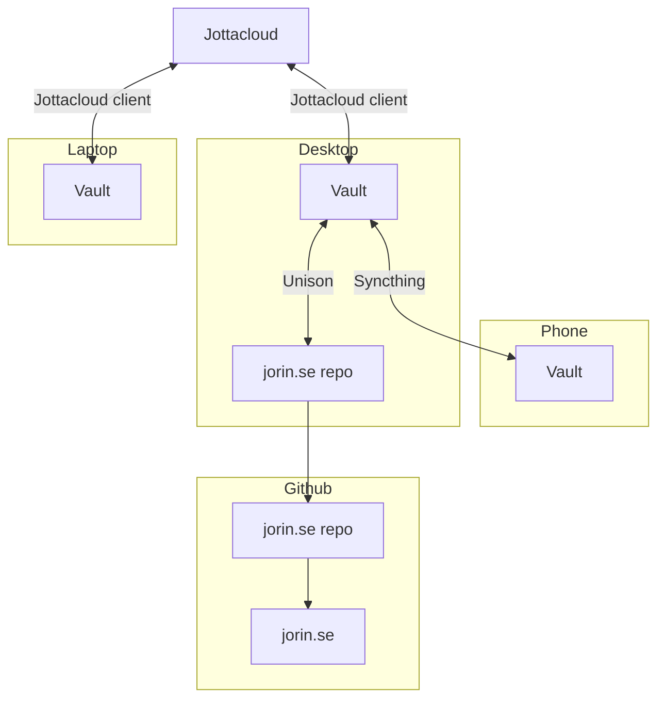

import { ExtLink, FunctionPlot } from 'pageComponents'

I've been working on rewriting my website in a Nextra-based stack. If you're
reading this, it's on the nextra-based website.

# Rationale

The previous iteration of jorin.se was written in Jekyll. It had some issues
and the pastures of Node/Next/Nextra were predictably greener:

- Jekyll, despite its attempts at genericisation in more recent releases, is
  kind of married to the blog format. Some things, e.g. tags, are rather
  inflexible. A lot of things became an uphill battle.

- I'm far more skilled with TypeScript and the Node ecosystem than with Ruby,
  allowing me to roll my own solutions where the tooling is lacking.

- The React ecosystem is well developed and may in particular enable useful
  features in pages.

# Goals

## Tech

- Static website hosted on GitHub Pages.

- [x] As much as possible of the site is rendered statically.

- JavaScript is optional and only required for interacting with some page
  components that are enhanced by interactivity.

## Theme

- The theme is fully re-usable.

- [x] The pages are divided into collections:

  - [x] Pages in different collections are fully separated.

  - [x] Each collection can be browsed alphabetically, by date, or by tags.

  - [x] Collections have individual sets of tags that can be browsed.

## Components in pages

Most of these are pretty major projects:

### Mathematics

LaTeX expressions are luckily built-in in Nextra:

```mdx
$ f(x) = 3x + 4 $
```

Gives:

> $ f(x) = 3x + 4 $

However, I'd also like to be able to include function plots. The library
[function-plot](https://www.npmjs.com/package/function-plot 'lang=en-US')
seems to do exactly what I want. It is not React based and I need to figure out
how to best integrate it.

### Circuit diagrams

There's some well-regarded existing tooling for circuits in web: Falstad
CircuitJS and KiCanvas. CircuitJS functions as a simulator, and is not quite
fit for displaying simpler diagrams. KiCanvas should work well, but for simpler
illustrations (e.g. showing how a RC filter is constructed) I'd prefer raw SVG.
There is no text based circuit language like LaTeX or Lilypond to my knowledge
though. If KiCad can render SVGs using the command line, that's a good enough
solution.

### Music

The dream is embedded Lilypond, akin to how LaTeX can be embedded in `$ dollar
signs $`, giving both the resulting notation and MIDI that can be played back
in the browser. Unfortunately browsers do not play MIDI files, and they would
have to be pre-rendered as waveform files. Lilypond can very easily be built
from the command line, the challenge here is building something that interfaces
between Nextra's build process and Lilypond.

### ✔ Color-coded code snippets

I was surprised this wasn't entirely built in, but the heavy lifting is. I just
had to add CSS variables for colouring and a custom component to include some
wrapping.

```typescript
const i = 3
function add(a: number, b: number): number {
  return a + b
}
```

# Log

## 2024-01-05

I started writing this page. I should probably be using an issue tracker but
keeping this on the page lets me test the things I'm writing about. It's handy.

The website has come a long way, most of the basics are done. The one site
structural thing missing that really sticks out is pages for tags. That will
require some digging into dynamic routes and if there's no support for it,
getting the site generator to recognise which tag routes to render will be a
pain.

After that, I need to build the various page components to better serve what I
want to keep on the site.

Finally, cleaning up the theme and making a demo site for it would be neat. As
far as I can tell, people pretty much only use the official Nextra themes
presently.

## 2024-01-14

I've spent some time refining various aspects of the front-end. Pages are
starting to look good with pure markdown. I've implemented seoul256 for code
highlighting. I've done a lot of refactoring to make the react side of things
smoother. MDX has been a pleasure to work with and I feel pretty familiar with
Nextra's features at this point.

The next step should be to implement tags. I'd also like to get graphs into
pages pretty soon. I've considered circuit diagrams a bit and I'm wondering if
circuitjs wouldn't be a good choice anyway, as the animation is incredibly
illustrative.

## 2024-01-16

After trying many different methods, I managed to implement browsable tags.
Nextra's features surrounding this have been quite lacking. There's no
documentation for `useSSG` or `useData` in Nextra 2 and I had to implement
enumeration of the files and parsing their front-matter myself, which seems
redundant as this is a huge part of what Nextra is meant to do for me. I'll not
be implementing a `/[collection]/tags`. Maybe as a redirect to the _By tag_ tab
on `/collection` just to keep the hierarchy properly navigable. This, along
with the desire to not require JS to browse, is another reason to implement my
own Tab component using `<details>`

It would probably serve me well to work towards publishing the site now. I've
made some strides in the project infrastructure to help with this and the site
statically generates properly, including pre-rendered components meaning it
should function without JS. The first load JS is about 180kB per page though,
which is alarmingly high considering how little the front-end JS actually does.
I don't think any components even can be re-rendered presently. The
pre-rendered pages are 8kB at most.

## 2024-11-26

It's been a while since I worked on the site. I found a certain lack of motivation in expanding the Grimoire due to complexity of editing it. Some while ago I was booted out of using [Notion](https://www.notion.com/) due to creating a shared space and being marked a commercial user who had to pay to use the tool. I switched to [Obsidian](https://obsidian.md/). But since it's not a one to one match, there was a good amount of labour and learning involved in the switch which I didn't get around to until recently. As luck would have it, Obsidian maps very well to the Grimoire of Jorin, and I've found some new energy to build compatibility. My new goal for the site is to integrate its contents into my Obsidian vault.

### Upgrading Nextra to 3.0

This part wasn't a lot of fun. The docs don't go very far into the internals and there were multiple changes part of 3.0 that weren't covered in the migration guide. Regardless, I got the site back to functional parity with the 2.x-based iteration.

### Synchronisation troubles

There were quite a few steps to get synchronisation working comfortably between relevant devices and places. I can't include my entire vault in the repository. And I can't include the entire working site repository in my vault. I need the vault files, including those from the site, on my phone and my laptop and I need the full vault backed up against a third-party storage provider.

Although I include all content from the site in my vault, synchronising the full repository as is adds a bit of friction to navigating to the relevant files. It would also mean syncing `node_modules` to my phone and cloud provider, which is wasteful of resources and time.

Vault synchronisation to the third party is done using [Jottacloud](https://jottacloud.com/en/). This also doubles as my synchronisation between desktop and laptop. To get the vault onto my phone, I use [Syncthing](https://syncthing.net/). Unfortunately there's not enough support between Jottacloud and Obsidian on Android to use that as a synchronisation mechanism. My understanding of this is that while Jottacloud supports modern Android storage APIs that exposes the Jottacloud cloud storage area to the system without needing it all locally, Obsidian only operates on local files proper. Finally, synchronisation between the vault and the repository is done using [Unison](https://www.cis.upenn.edu/~bcpierce/unison/) on my desktop. I made a systemd service for this available [here](https://gist.github.com/jorins/8ad977a952b328569f2e847e5e34362f). Is that a mess or what? 😄



### Limitations and challenges of Obsidian compatibility

There's some limitations in Obsidian that'll require me to make changes to the website.

- There's a limited set of supported data types for the front matter.
- Markdown links don't parse in the front matter (wiki links and plain text links still do).
- Tags cannot contain spaces.
- MDX does not work natively.

Conversely, there's limitations to my website that'll have me taking precautions in Obsidian:

- I have not implemented support for hierarchical tags.

As such, there's some things I need to do:

- Convert further reading links to plain text links and add additional data for them elsewhere.
- Convert related article lists to lists of links.
- Change tag formatting to `CamelCase`.
- Deprecate usage of custom components and look into alternatives that can work in both Obsidian and on the web.
- Co-locate resources related to pages with said pages, so as to make sure they are usable in both.

I think I can overcome most of this. Some changes might feel detrimental to the website's design in isolation, but good support for Obsidian is a larger benefit to me long-term.

### Site performance

I'm a bit worried I'm actually failing to make the site performant. The largest pitfalls would be bundle size, dynamic rendering where not needed, and intense graphical rendering due to the combination of animation and blurring effects in the background. I should absolutely see what I can do to benchmark possible issues here. In the spirit of making this website one of free culture, I think accessibility is an incredibly important aspect.
